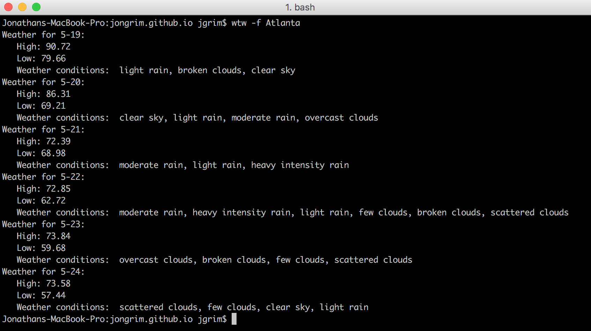

Laziness is the mother of invention, or something like that.

I got tired of always having to open a browser window to get weather info. Since I almost always have a terminal open, I figured that was an easy place to get the information instead. For this project I make use of the [OpenWeatherMap API](https://openweathermap.org/api), and I challenged myself to also learn how to package Python source code so that it can be installed using the Pip tool that comes with Python. That means you can download and use it too!

### Project Code
[GitHub](https://github.com/jongrim/whats-the-weather)

### Languages
- Python

### Notable Code
An interesting bit to me was how to correclty loop through the JSON returned when requesting forecast data for a city. The goal of the `process_forecast_data` function is to build a more usable dictionary of weather information that is sorted by day which has the following information - Max temperature for that day, Min temperature for that day, and all the weather conditions predicted. Also, since the forecast data includes information for every 3 hours, I had to consolidate it into something more readable. It would be way too much data to print out if I printed every three hour measure!

To accomplish this, I loop through the JSON and create dictionary key for the day corresponding to the timestamp of the weather measurement. I use Python's `setdefault` method so that the first time a day is encountered, I can create an empty dictionary for its data, but after that, any calls to add that key will not override what has already been stored.

Following this, it was simply a matter of converting the temperatures from kelvin to fahrenheit and watching for the max and the min temperatures reported for each day. And for the weather descriptions I maintain a list of all reported. They get joined appropriately when printing to the screen.

Voila! A sensible collection of data to report back.
```python
def process_forecast_data(forecast_dict):
    '''Loop through the forecast data and build up a summary'''
    data_list = forecast_dict['list']
    daily_weather = {}

    # Dict keys
    max_temp = 'max_temp'
    min_temp = 'min_temp'
    wthr_conds = 'wthr_conds'
    for measure in data_list:
        date = convert_timestamp_to_datetime(measure['dt'])
        day = date.day
        daily_weather.setdefault(day, {})
        day_d = daily_weather[day]

        day_d.setdefault('month', date.month)

        # Search for maximum temp of the day
        cur_max = convert_kelvin_to_f(measure['main']['temp_max'])
        day_d[max_temp] = max(day_d.get(max_temp, 0), cur_max)

        # Search for minimum temp of the day
        cur_min = convert_kelvin_to_f(measure['main']['temp_min'])
        day_d[min_temp] = min(day_d.get(min_temp, 150), cur_min)

        # Set and add weather conditions
        day_d.setdefault(wthr_conds, [])
        cur_cond = measure['weather'][0]['description']
        if cur_cond not in day_d[wthr_conds]:
            day_d[wthr_conds].append(cur_cond)

    return daily_weather
```

Later, when it gets printed, the result looks like this:



### Final Notes
Sometimes, it's the little things in life, like not having to open a browser to check the weather, that make a difference.
